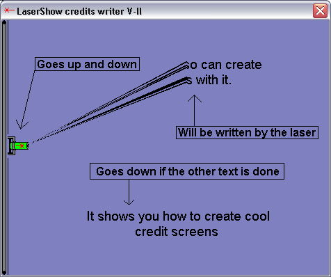

<div align="center">

## LaserShow Credits or Picture Writer \*UPDATE\*


</div>

### Description

This code writes images to a form using lines (Look like laser beams) and lets the writed text or picture go down smoothly, Now the laser moves also and the writed text waits at the en of the form until the new one arrives.
 
### More Info
 


<span>             |<span>
---                |---
**Submitted On**   |2002-03-17 08:55:30
**By**             |[Peter Hebels](https://github.com/Planet-Source-Code/PSCIndex/blob/master/ByAuthor/peter-hebels.md)
**Level**          |Advanced
**User Rating**    |4.7 (80 globes from 17 users)
**Compatibility**  |VB 6\.0
**Category**       |[Graphics](https://github.com/Planet-Source-Code/PSCIndex/blob/master/ByCategory/graphics__1-46.md)
**World**          |[Visual Basic](https://github.com/Planet-Source-Code/PSCIndex/blob/master/ByWorld/visual-basic.md)
**Archive File**   |[LaserShow\_628963172002\.zip](https://github.com/Planet-Source-Code/peter-hebels-lasershow-credits-or-picture-writer-update__1-32627/archive/master.zip)

### API Declarations

```
Public Declare Function BitBlt Lib "gdi32" (ByVal hDestDC As Long, ByVal X As Long, ByVal Y As Long, ByVal nWidth As Long, ByVal nHeight As Long, ByVal hSrcDC As Long, ByVal xSrc As Long, ByVal ySrc As Long, ByVal dwRop As Long) As Long
Public Declare Function GetPixel Lib "gdi32" (ByVal hDC As Long, ByVal X As Long, ByVal Y As Long) As Long
Public Declare Sub Sleep Lib "kernel32" (ByVal dwMilliseconds As Long)
```


